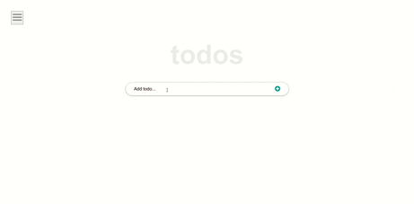

# React-Todo

> **React-Todo** is an SPA made for people who want to have an organised list for their day-to-day tasks. It is fruit of a walkthrough of the extensive introduction to React, originally made by [ibaslogic](https://ibaslogic.com/react-tutorial-for-beginners/).

## Built With

- React (CRA)

## sneak peek

## Getting Started

**Prerequisites:** A Web Browser (preferably FireFox or Chrome)
To get a local copy up and running follow these simple example steps.

### **Option 1**

#### Use the live Website

[React-Todo Website](https://sboursen.github.io/React-todo/)

### **Option 2**

#### Set up your own copy locally

- Clone [the GitHub Repository](https://github.com/Sboursen/React-todo)
- Go to the Project `cd React-todo`
- Run `npm install` to install the _dependencies_
- Run `npm start` to run the live server.

## About me

👤 **Soufiane Boursen**

- GitHub: [@Sboursen](https://github.com/Sboursen)
- Twitter: [@sboursen_dev](https://twitter.com/sboursen_dev)
- LinkedIn: [@sboursen](https://linkedin.com/in/sboursen)

## Contributors

Contributions, issues, and feature requests are welcome!

Feel free to check the [issues page](../../issues/).

## Show your support

Give a ⭐️ if you like this project!

## Acknowledgment

- This React tutorial was originally made by [ibaslogic](https://ibaslogic.com/react-tutorial-for-beginners/)

## 📝 License

This project is under the [MIT](./LICENSE) license.
